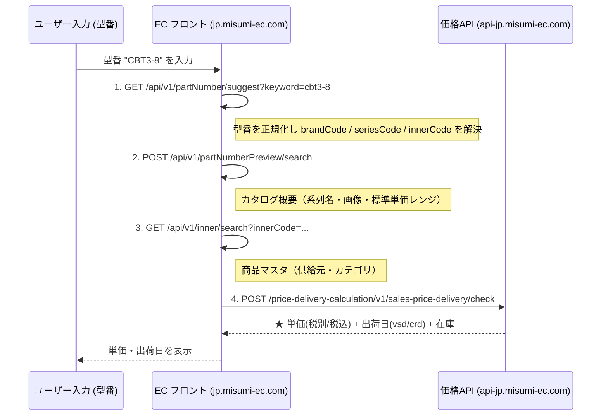

# 02. API 連鎖：型番入力 → 単価・出荷日

型番を入力して確定すると、以下の 4 段の内部 API が順に呼ばれる（`CBT3-8` で観測）。

## シーケンス

## 各ステップ要約

| # | メソッド / エンドポイント | 入力 | 出力（要点） |
|---|---|---|---|
| 1 | `GET /api/v1/partNumber/suggest` | `keyword`（型番文字列） | `partNumber`, `brandCode`, `seriesCode`, `innerCode`, `completeType` |
| 2 | `POST /api/v1/partNumberPreview/search` | `seriesCode`, `completeType`, `partNumber` | 系列名・カテゴリ・画像・`min/maxStandardUnitPrice`・標準出荷日数・CAD 有無 |
| 3 | `GET /api/v1/inner/search` | `innerCode` | 供給元コード・商品マスタ名・カテゴリ階層 |
| 4 | `POST .../sales-price-delivery/check` | `qty`, `inputProductCode`, `brandCode` | **実単価（税別/税込）・出荷日・在庫・納期割引情報** |

## 最小経路

単価・出荷日だけが欲しい場合、実は **ステップ 1 と 4 だけで足りる**：

1. `suggest` で型番から **`brandCode`** を得る（自社品ならほぼ `MSM1`）。
2. `sales-price-delivery/check` に `{qty, inputProductCode, brandCode}` を投げる。

ステップ 2・3（preview / inner）は、画面に系列名・画像・カテゴリを出すための付帯情報であり、価格・出荷日の取得には必須ではない。

> 各 API の詳細フィールドは [03](./03-price-delivery-check.md) と [04](./04-supporting-endpoints.md) を参照。
